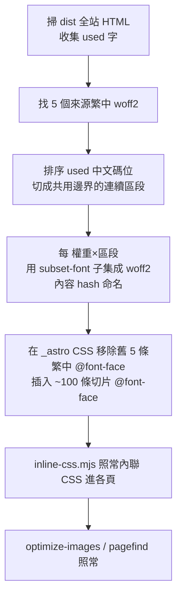

# 字型 unicode-range 切塊設計（共享、可快取、固定檔數）

> 日期：2026-06-16
> 作者：Lightman（CΛ）
> 目標：把全站繁中字型從「逐頁子集（檔數隨內容無限膨脹、無跨頁快取、build 成本高）」改為「依碼位連續切塊的共享字型」，達到 **固定檔數、跨頁可快取、build 秒～分鐘級、只下載當頁命中的切片**，同時不退首頁基準（desktop 100 / mobile ≥90）、改善內頁 mobile。

## 0. 背景與為何轉向

- 內頁 mobile 曾 ~56、FCP ~11.5s。根因是 render 關鍵路徑被字型主導（CSS 已內聯、render-blocking 已 0、圖片 bytes 非瓶頸）。
- 既有 `subset-fonts.mjs` 的子集是「全站用字聯集」，內容長到 279 篇後膨脹到 ~470–647KB/權重，內頁載 5 權重 ~2MB。
- 先前的「逐頁迷你字型」雖能降單頁字型量，但代價是 **檔數 = 頁數 × 權重**：全站 1371 內容頁推估 3000–4500 檔、350–500MB、且**無跨頁快取**（每點一頁重抓 5 個全新字型）、隨每日發文**無限膨脹**、build 需逐頁子集上千次。這是架構層級的錯誤。
- 正確解法是 CJK web font 的業界標準：**unicode-range 切塊**（如 Google Fonts 服務 Noto CJK）。把每權重切成固定數量的小塊，每塊一條帶 `unicode-range` 的 `@font-face`，瀏覽器只下載當頁出現字命中的塊；每塊 URL 全站固定 → 跨頁吃快取；塊數與文章數無關 → 永不膨脹。

## 1. 關鍵決策

### 1.1 依碼位連續切（非字頻）
- **依碼位連續切**：每塊一段連續 Unicode 範圍，`unicode-range:U+4e00-53ff` 精簡寫法，~75–100 條規則合計僅 ~2–3KB CSS，可直接內聯、零額外請求。
- 不採字頻排序：字頻雖能讓每頁抓的塊更少，但每條 `@font-face` 要列散落個別碼位，CSS 膨脹到 ~120KB，無法逐頁內聯。本站僅 3483 used 字、總量 ~2.3MB，字頻省下的請求數有限，不值得這代價。

### 1.2 `font-display: optional`（沿用既定策略）
- optional 下字型位元組不擋首屏：首次冷啟動以系統字立刻定版，品牌字背景載入、下次（已快取）顯示。因此本設計不追求「首屏字型最小」，而是「宣告可共享、可快取、正確不擋渲染」。

### 1.3 用真實 family，不再逐頁換棧
- 切片 `@font-face` 用**真實 family 名**（`Noto Sans TC` / `Noto Serif TC`），字型棧維持 `'Noto Sans TC', <系統字>`。棧中只有這一個 web font，故先前為繞「坑#2（optional 後備抓棧中下一個 web font）」而做的逐頁 `:root` 換棧**不再需要**。逐頁機制、首頁專屬 mini、Python 批次子集全部移除。

### 1.4 切塊參數
- 5 個權重：sans 400/500/700、serif 600/700。**各權重共用同一組區段邊界**。
- 每段約 150–200 個 used 字 → 約 15–20 段/權重 → 全站 **約 75–100 個字型檔，固定不變**。
- `unicode-range` 取每段碼位的 **min–max 單一範圍**。未使用字不會出現在靜態 HTML，故不會誤觸發請求；落入某段範圍但缺字（僅可能來自被排除的 admin 動態文字）則落回系統 CJK。

## 2. 架構與資料流

- `subset-fonts.mjs` 在 postbuild 串接首位（順序不變：subset-fonts → optimize-home-images → optimize-article-images → inline-css → pagefind）。
- 切片 CSS 改在 `_astro` 的 CSS 檔，讓後續 `inline-css.mjs` 自動內聯，毋須各頁另行注入。

## 3. 檔案結構

- **新增** `scripts/lib/font-slicing.mjs`（純函式，可單測）：
  - `partitionCodepoints(usedChars, targetPerSlice)` → 回傳區段陣列，每段 `{ cps: number[], min, max }`；涵蓋全部 used 字、不重疊、依碼位連續、大小均衡。
  - `unicodeRange(min, max)` → `'U+4e00-53ff'` 字串。
  - `faceCss(family, weight, srcUrl, range)` → 一條 `@font-face{...font-display:optional...unicode-range:...}`。
  - `replaceFontFaces(css, replacements)` → 移除指定 family 的舊 `@font-face`、插入新規則；回傳新 CSS 與是否有改動。
- **重寫** `scripts/subset-fonts.mjs`：orchestration（掃描 → 切割 → 子集 → 寫檔 → CSS 取代）。移除 mini-fonts/Python 相關。
- **刪除** `scripts/subset_pages.py`、`scripts/lib/mini-fonts.mjs`（及其測試）。
- **還原** `.github/workflows/deploy.yml`：移除 `setup-python` 與 `pip install fonttools brotli` 步驟。
- **同步** `PERFORMANCE.md` §2、§5：描述切塊機制與新內頁基準。

來源字型（postbuild 時 `_astro` 內，檔名帶 astro hash）：
`noto-sans-tc-chinese-traditional-{400,500,700}-normal.*.woff2`、`noto-serif-tc-chinese-traditional-{600,700}-normal.*.woff2`。

## 4. 元件契約

- **used 字來源**：沿用現行 baseline 白名單（ASCII 可見字 + CJK/全形標點 + 常見符號）＋掃描全站 HTML 的所有字元。**切割對全部 used 碼位一視同仁**（含 ASCII）：ASCII/latin 會落入最低碼位的切片，但因字型棧中 latin 由 Inter 勝出，瀏覽器渲染 latin 時不會選用繁中字型，也就不會請求那個切片。故毋須特別把 latin 排除，邏輯更單純。
- **子集工具**：`subset-font`（現有 npm 依賴，純 JS，無外部執行檔），約 100 次、~3 分鐘。
- **冪等**：切片檔名 = `<srcbase>.slice-<i>.<contentHash>.woff2`；內容不變 → hash 不變。
- **CSS 取代**：以 `@font-face\{[^}]*\}` 掃描，凡 block 內含對應 family 來源檔名者移除，於該 CSS 檔尾插入該 family 的切片規則。

## 5. 錯誤處理

- 找不到來源繁中字型 → `console.warn` 後 `process.exit(0)`（同現行，避免擋 build）。
- 任一切片子集失敗 → `console.error` 後 `process.exit(1)`。
- 找不到可取代的 `@font-face`（CSS 結構變動）→ 明確 warn，仍寫出切片檔，避免靜默不套用。

## 6. 驗收

- `pnpm build && pnpm check:links` 全綠。
- build 回到分鐘級（無逐頁子集）。
- 字型檔 ~75–100 個、固定；`du` dist 字型總量 ~2.3MB（原 182MB+）。
- 抽查文章 HTML：內聯 CSS 含切片 `@font-face` + `unicode-range`，且無舊單體字型引用。
- **線上 PSI（第三方、對 GitHub Pages）**：首頁 desktop 100 / mobile ≥90 不退；文章頁 mobile ≥90 或記錄實值為新基準；抽 tag 頁、作者頁各一。
- Playwright 或 PSI network：確認每頁只抓少數切片，非舊 470KB×5 單體、非 182MB 逐頁。
- 回填內頁基準到 `PERFORMANCE.md`。

## 7. 測試

- `scripts/lib/font-slicing.mjs` 純函式單測：
  - `partitionCodepoints`：聯集涵蓋全部輸入字、區段不重疊、依碼位遞增、各段大小落在目標範圍。
  - `unicodeRange`：min/max 轉 `U+xxxx-yyyy` 格式正確（含同碼位 min==max 的單點情形）。
  - `faceCss`：含 `font-display:optional`、正確 weight/family/url/unicode-range。
  - `replaceFontFaces`：移除指定 family 舊 `@font-face`、保留其他 family、插入新規則、回報改動旗標。
- build 後 smoke：字型檔數在 [70, 120]、抽樣文章 HTML 含切片規則且無舊引用。

## 8. 風險

| 風險 | 緩解 |
|------|------|
| 共享切塊仍上不了 mobile 90 | 驗收強制線上 PSI；optional 下字型不擋首屏，理論上達標；不足則記錄實值並評估其他槓桿 |
| CSS 取代漏改 / 結構變動 | `replaceFontFaces` 找不到目標時明確 warn；smoke 檢查抽樣 HTML 無舊引用 |
| 動到 `subset-fonts.mjs` 弄壞首頁 | 首頁與內頁走同一套切片；驗收強制 PSI 複測首頁 100/≥90 |
| 來源字型同時有 woff/woff2 | 只生成並宣告 woff2 切片；移除舊 woff/woff2 兩種繁中 @font-face |

## 9. 交付項

1. `scripts/lib/font-slicing.mjs` + 單測。
2. 重寫 `scripts/subset-fonts.mjs` 走切塊。
3. 刪除 `subset_pages.py`、`mini-fonts.mjs`（+測試）；還原 `deploy.yml`。
4. `PERFORMANCE.md` 同步切塊說明與內頁基準。
5. 驗收：build + check:links + 多頁型線上 PSI（首頁不退、內頁達標或記實值）。
