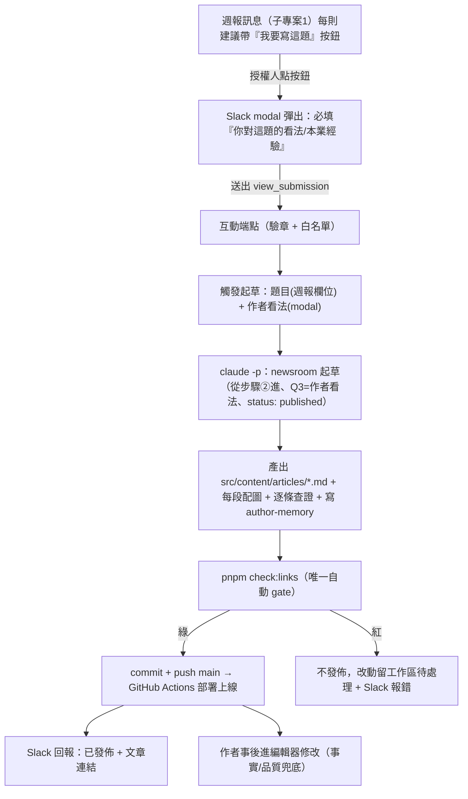

# 無人值守數據選題 → 自動產文（子專案 2）設計【草稿，待拍板】

> 日期：2026-06-16｜狀態：**草稿**，核心架構已定案、次要項待拍板（見 §9）｜作者：server 上的 Claude
> 範圍：把子專案 1（週報）產出的「建議寫作方向」接成一條**自動產文管線**：人挑題 + 給看法 → 自動起草 → **直接發佈上線**（`status: published`，與 newsroom 日更一致）→ 作者事後進編輯器修改。
> 前置：子專案 1 已上線（GA4/GSC 資料層 + 週報 → Slack + cron）。本案站在其資料層與 Slack 投遞之上。

## 1. 背景與目標

子專案 1 每週把站內（GA4/GSC）需求與外部熱題融合成 **2–6 個帶數據依據的建議方向**，欄位已**刻意對齊 newsroom 雷達格式**（`標題 / 訊號依據 / 建議切角 / 候選結論 / 建議分類`，週報 spec §6）。子專案 2 要把「人看完週報後決定寫哪幾題」這一步，接到 `/newsroom` 引擎自動起草。

**目標**：作者在 Slack 上對週報建議挑某幾題 + 給一句看法 → 系統自動起草成符合內容鐵律的文章 → **`check:links` gate 通過後直接 `status: published` 發佈上線** → 作者事後進編輯器修改（與現有 `/newsroom` 日更「寫完 push 上線」一致）。

**範圍：只限「科技類」（`category: tech`）**。`/newsroom` 是 APPI **科技類**日更引擎（CLAUDE.md「科技類日更靠 `/newsroom`」、skill 描述「科技類日更引擎」），本管線承襲此界線，**只自動產 `tech` 類文章**（子分類見 `src/config/categories.ts`：ai/資安/數位工具/軟體與產品/新創/半導體/產業科技/科技政策）。其餘 7 類（focus/international/health/finance/sports/lifestyle/columns）**不在本案、維持人工**。週報雖讀全站數據，但**只有 `tech` 適配的建議才掛自動產文按鈕**；非科技題不觸發。

**設計決定（2026-06-16，作者拍板）**：**寫完直接發佈、事後在編輯器修改，不走 PR**。理由：現有 `/newsroom` 日更本就是「寫完 `git push` 上線」（SKILL.md 步驟四），作者習慣發佈後再編輯；硬加 PR 是過度保守。**唯一保留的自動關卡是 push 前的 `check:links`**（壞連結會擋整站部署，這關 newsroom 步驟四本就有，沿用、非新增、不擋人）。**取捨**：直接發佈代表萬一有杜撰的「事實」會先上線、由作者事後編輯抓（死連結 gate 與看法 gate 仍在，但事實查證非百分百）。

**非目標（明確排除，不可破）**：
- **非科技類不自動產文**（見上「範圍」）。
- 不繞過 `check:links`（站內壞連結硬性擋整站部署）、禁杜撰/禁政治/去 AI 腔等內容鐵律。
- 不在本案處理 Cloudflare/AEO（另案）。

## 2. 系統定位

```
共用資料層（子專案 1 已建）：GA4 + GSC（google-data.mjs）
  └─ 子專案 1：週報 → Slack（定時、唯讀、低風險）✅ 已上線
      └─ 子專案 2（本案）：建議方向 → 人挑題+給看法 → 自動起草 → check:links gate → 直接發佈上線（對外、**高風險**）
```

**「無人值守」的正確定義**：無人值守的是**找題（雷達）、起草、查證、配圖、發佈**這條主幹；**人只在兩個點介入**——起草前挑題並給看法、發佈後在編輯器修改。

## 3. 風險盤點與不可退讓的安全原則

本案碰 APPI 三條鐵律，逐條對應防線：

| 風險 | 來源鐵律 | 防線 |
|---|---|---|
| **杜撰**（捏造數據/來源/引用） | 禁杜撰 | newsroom 既有「全文超連結逐條查證」迴路（每條 2xx 且支持該句）。**直接發佈下的殘餘風險**：捏造的「事實」可能先上線，由作者**事後在編輯器**抓改（作者已接受此取捨）|
| **壞連結擋整站部署** | check:links 硬 gate | **push 前本機跑 `check:links`**，沒過就不發佈（一條死連結會讓整站這次 deploy 失敗，不只該篇）。唯一自動關卡 |
| 政治/中國用語/AI 腔 | 內容紀律 | 沿用 newsroom persona 與守則 + 文風複查；殘餘由作者事後編輯 |
| **通用化 / 杜撰個人經驗** | 禁杜撰 + 差異化 | newsroom Q3「真人觀點/本業經驗」週報沒得填；**Slack modal 必填作者看法，沒收到不動筆**，機器人永不捏造個人經歷（見 §4、§6）|

**一句話原則**：**人在兩個點把關**——起草前給看法（禁杜撰根防線）、發佈後在編輯器修改（品質與事實兜底）；中間全自動，唯一硬性自動 gate 是 `check:links`。

## 4. 觸發機制（已定案：Slack 按鈕 + 看法 modal）

**兩個拍板決定（2026-06-16）**，它們互相咬合：

1. **必須收到作者看法才動筆**（Q1 決議）：寫稿前一定要先拿到作者對該題的真實看法，**沒收到就不寫**。這是禁杜撰的根防線——「真人觀點」是**必要人工輸入**，機器人永不自行杜撰。
2. **用 Slack 按鈕觸發**（Q2 決議）。

合起來：**光按鈕不夠**（按鈕只回一個 action，帶不了一段看法）。所以流程是 **按鈕 → 跳 Slack modal（必填文字框：你對這題的看法/本業經驗）→ 送出才觸發寫稿**。modal 的文字就是 newsroom 步驟②Q3 的輸入。

**因此本案要新建一個 Slack 互動端點**（這是決定的必然代價，明列）：

| 新增物 | 用途 |
|---|---|
| 常駐 HTTP server（公開 HTTPS Request URL） | 收 Slack 的 `block_actions`（按鈕）與 `view_submission`（modal 送出）回呼 |
| **Slack signing secret 驗章** | 驗證每個回呼真的來自 Slack（必要安全措施，新機密進 `report.env`） |
| Slack app 設定 | 開 Interactivity、設 Request URL、加按鈕到週報訊息、`views.open` modal |
| 授權人白名單 | 只有名單內的 Slack user 觸發才算數（見 §9）|

> 端點可掛在現有 pm2/NPM 機制下（本機已有同類常駐服務 + NPM 反代，見主機手冊）。**唯讀風險已不再，這是會「寫」的對外端點，安全設計（驗章、白名單、速率限制）是硬需求。**

## 4b. 人介入的兩個點

(1) 點按鈕並**輸入看法**（起草前，禁杜撰根防線）、(2) 發佈後**在編輯器修改**（事實與品質兜底）。中間的找料、查證、撰寫、配圖、發佈全自動。直接發佈是作者的編輯選擇；看法 gate + `check:links` 仍是硬性自動防線。

## 5. 端到端流程



## 6. newsroom 非互動化（核心技術點，逐步對齊真實 SKILL.md）

newsroom 是**互動式日更引擎**，四步：①議題雷達 →②`AskUserQuestion` 逐題問答（5 問）→③逐題起草（查料/擴寫/**逐條查證**/每段配圖/去 AI 腔複查/產檔/本地預覽）→④批次排程 + `git push`。無人值守不是「跳過問人」這麼簡單，要逐步決定**保留 / 取代 / 覆寫**：

| newsroom 步驟 | 無人值守如何處理 | 風險/注意 |
|---|---|---|
| **①議題雷達** | **取代**：週報（子專案 1）已做雷達+評分+對 author-memory 去重，無人值守流程**從步驟②進入**，不重跑 newsroom 雷達（避免雙重掃描與不一致） | — |
| **②逐題問答（5 問）** | 可填的用週報欄位**預填**；**Q3 真人觀點改由 Slack modal 必填收集**（見下表） | Q3 是禁杜撰防線，已定為硬性必填 |
| **③起草/查證/配圖/文風複查** | **完全保留，不可打折**。查證迴路（每條連結 2xx 且內容支持該句）是禁杜撰核心防線 | 配圖會 headless 跑 `gen-image.mjs` 逐段 + 封面，產多個 webp 進 repo（成本+二進位） |
| **③.9 寫入 author-memory** | **保留**：照 newsroom 在發佈時寫 `author-memory.json`（直接發佈無退稿問題，不會污染） | 與 newsroom 一致 |
| **③.10 本地預覽（互動 gate）** | **取代**：由**發佈後在編輯器修改**取代（作者習慣的事後編輯） | 不擋發佈 |
| **④批次排程 + `git push`** | **保留為主**：`publishDate` 設現在、`status: published`，**push 前先 `check:links` gate**，過了才 push main 上線（與 newsroom 一致） | 唯一改動是把 check:links 設成硬性前置 |

**步驟②五問的預填對照（關鍵缺口在 Q3）**：

| newsroom 提問 | 週報欄位可否預填 | 缺口處理 |
|---|---|---|
| Q1 核心結論 | ✅ `候選結論` | — |
| Q2 切角/強調面向 | ✅ `建議切角` | — |
| **Q3 真人觀點/本業經驗（差異化來源）** | ❌ 週報沒這格 | **已定案：Slack modal 必填**。作者點按鈕後在 modal 打一段看法，送出才動筆；**沒收到就不寫**，機器人永不杜撰個人經歷。modal 文字直接當步驟②Q3 輸入 |
| Q4 篇幅與讀者 | ❌ 無 | 設**預設值**（短稿 800–1500 字）；modal 可附選填欄覆寫 |
| Q5 指定必引來源（可選） | 部分（`訊號依據`含來源） | 可空 |

> author-memory 的「先前立場 A，延續還是修正？」在無人值守下：預設**延續**既有立場（不主動翻案），有矛盾就保守處理、留待作者事後編輯。

**落地（已實作 Phase 0）**：外包 `scripts/newsroom-write.mjs` 以 `claude -p` 帶結構化輸入呼叫同一套起草邏輯（吃工單 JSON、從步驟②進、跳 `AskUserQuestion`、`status: published`、push 前 `check:links` gate）。工單驗證在 `scripts/lib/newsroom-job.mjs`（強制 tech-only + 看法必填）。**起草與查證品質一字不減**，只動「問人」（改預填 + modal 收看法）與「本地預覽」（改事後編輯）兩個節點。

## 7. 發佈與事後編輯

- **排期（Phase 2，預設）**：預設排到「最近一個還沒有文章的日子」（掃既有 `publishDate` 找空檔，維持日更）。該日＝今天 → `status: published` 立即上線；未來 → `status: scheduled` + 該日 08:00（+08:00），由 6h cron 到時自動現身。**modal 選填日期可覆寫**（指定特定日）。實作：`scripts/lib/publish-slot.mjs`（`nextOpenPublishDate`）+ 引擎 `computeSchedule`。
- **push 前唯一硬性 gate：`pnpm check:links`**。綠 → `git add -A && commit && push`，GitHub Actions 部署；紅 → 不發佈，改動留工作區待處理 + Slack 報錯（避免壞連結擋整站部署）。
- 上線後作者**進編輯器修改**（事實、用詞、補強真人觀點）。這是品質與事實的事後兜底。

## 8. 失敗處理（無人值守：失敗要出聲）

- **非 `tech` 題誤入起草引擎 → 硬拒、不產文**（UI 已只對 tech 掛按鈕，引擎再驗一次 `category==='tech'`，雙保險）。
- 收不到合法 view_submission（驗章失敗 / 非白名單）→ 不動作（安全預設）。
- modal 看法欄空白 → Slack 端擋下，不送出（必填）。
- newsroom 起草失敗 / 沒產出文章 → **不發佈**，發 Slack「⚠️ 自動起草失敗：<原因>」。
- `check:links` 紅 → **不 push**、改動留工作區，Slack 報錯等人處理（壞連結會擋整站部署）。
- 防重入：記錄已觸發的 action/submission id，避免同一次點按重複起草。

## 9. 已定案 vs 待拍板

**已定（2026-06-16）**：① 觸發＝Slack 按鈕 + 看法 modal（§4）；② 真人觀點＝modal 必填、沒收到不動筆（§4、§6）；③ **發佈＝push main、不走 PR、事後編輯；預設排到最近空檔（維持日更）、modal 可指定日期，當天空檔則立即 `published`；唯一自動 gate＝`check:links`**（§7）；④ author-memory 照 newsroom 在發佈時寫（§6）。

**仍待你拍板（次要，不卡主結構）**：

1. **授權人白名單**：哪些 Slack user 點按鈕/送 modal 才算數？
2. **每次上限**：一批最多自動產幾篇（建議硬上限 ≤3）。
3. **篇幅預設**：預設短稿（800–1500）還是深稿？modal 要不要加選填覆寫。
4. **配圖成本**：每段 + 封面都跑 `gen-image.mjs`，要不要設圖數上限。
5. ~~立即發佈 vs 排期~~（**已實作 Phase 2**：預設排到最近空檔、modal 可指定日期、當天空檔即時發）。
6. **端點落腳**：互動端點掛 pm2 + NPM 反代（沿用主機現有模式），用哪個網域/路徑。

## 10. 分階段交付建議

- **Phase 0（已實作主幹）**：起草引擎 `scripts/newsroom-write.mjs` + 驗證 `scripts/lib/newsroom-job.mjs`——吃「題目 + 作者看法」工單 → newsroom 從步驟②起草（`status: published`）→ `check:links` gate → push 上線。預設 dry-run（零副作用），`--go` 才真發。先用 CLI 手動餵工單驗證「起草 + 查證 + 發佈」整條。
- **Phase 1（Slack 按鈕 + modal，最終形態）**：建互動端點（驗章 + 白名單）、週報訊息加按鈕、`views.open` 收看法 → 組工單接 Phase 0 引擎 → Slack 回報已發佈連結。
- **Phase 2（打磨）**：每批上限、配圖策略、排期選項、Slack 回報格式。

> Phase 0 的起草引擎與 Phase 1 的 Slack 端點解耦：先驗證「會不會寫出能看、不杜撰、查證全綠的稿」，再接「怎麼從 Slack 觸發」。
> 本檔含已定案（§9 上半），§9 下半的次要項拍板後即可拆「實作計畫」（`docs/superpowers/plans/`）。
