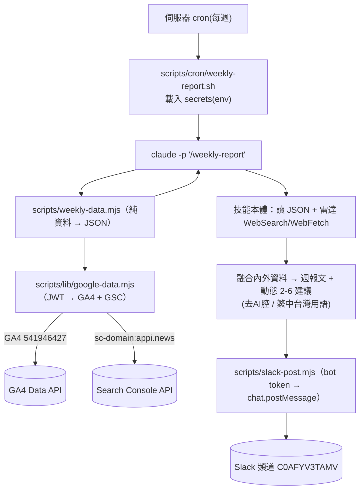

# 每週數據週報 → Slack（子專案 1）設計

> 日期：2026-06-16｜狀態：設計定案，待拆實作計畫
> 範圍：**只含「GA4/GSC 數據層 + 每週 Slack 週報」**。無人值守自動產文是子專案 2，另開 spec。

## 1. 背景與目標

APPI News（`https://appi.news/`，Astro 靜態站 + GitHub Pages）已接上 GA4（property `541946427`、gtag `G-38R2SZ5FTQ`）與 Google Search Console（網域資源 `sc-domain:appi.news`）。本案要把這兩邊的數據，每週彙整成一份 Slack 週報，幫作者 CΛ / Lightman 決定「下一篇寫什麼」。

**目標**：每週自動產一份週報發到 Slack，內容含四類數據 + 動態 2–6 個帶數據依據的建議寫作方向，供人工確認後再決定是否讓 `/newsroom` 撰寫。

**非目標（明確排除）**：
- 不做無人值守自動發稿（子專案 2）。本案的建議方向是給人看、由人拍板，保留人工關卡，繞開禁杜撰/品質風險。
- 不做 Cloudflare 上架與「AI 爬蟲抓取/被引用」量測（見 §5 資料限制；另案，且非本案前置）。

## 2. 系統分解與本案定位

```
共用層：GA4 + GSC 數據讀取（service account JWT）
  ├─ 子專案 1（本案）：週報 → Slack　定時、唯讀、低風險
  └─ 子專案 2（後續）：數據選題 → 無人值守自動產文　接 newsroom 雷達、對外發佈、高風險
```

兩子專案共用「數據讀取層」。先做子專案 1：邊界清楚、唯讀、能立即交付，並在真實環境跑通「數據層 / Slack 投遞 / 排程」三條管線，供子專案 2 站在其上。

## 3. 架構（方案 A：技能 + 小腳本）



### 元件（各單一職責、可獨立測試）

| 元件 | 職責 | 依賴 | 獨立驗證 |
|---|---|---|---|
| `scripts/lib/google-data.mjs` | 服務帳號 JWT 換 token；包 GA4 `runReport`、GSC `searchanalytics.query`。**子專案 2 共用** | 金鑰(env)、`node:crypto` | 單元測試(mock fetch) + 真打唯讀 |
| `scripts/weekly-data.mjs` | 叫上層，組四類數據，印結構化 JSON（不含 LLM） | google-data.mjs | `node weekly-data.mjs` 看 JSON |
| `scripts/slack-post.mjs` | bot token 打 `chat.postMessage` 到指定頻道；支援 Block Kit | `SLACK_BOT_TOKEN`(env)、頻道(config) | 單元測試(mock) + 真發測試頻道 |
| `scripts/lib/report-config.mjs` | 非機密設定：GA4 property、GSC site、Slack 頻道 ID | — | — |
| `.claude/skills/weekly-report/SKILL.md` | 唯一需 Claude 的部分：讀 JSON → 雷達 → 合成週報+建議（套文風守則） → 叫 slack-post | weekly-data、WebSearch、slack-post | 本機 `claude -p` 試跑、發測試頻道 |
| `scripts/cron/weekly-report.sh` | cron 進入點：載入 secrets → `claude -p "/weekly-report"` | — | 手動跑 |

## 4. 資料層介面

`scripts/lib/google-data.mjs` 匯出：
```
getAccessToken(scopes)  → JWT 自簽換 OAuth token（node:crypto，無外部相依）
ga4RunReport(body)      → POST properties/541946427:runReport
gscQuery(body)          → POST sites/sc-domain:appi.news/searchAnalytics/query
```
- 金鑰路徑讀 env `GOOGLE_APPLICATION_CREDENTIALS`（預設 `~/.config/appi-news/ga4-sa.json`）。
- property / site 從 `report-config.mjs` 取。scopes：`analytics.readonly` + `webmasters.readonly`。

`scripts/weekly-data.mjs` 輸出 JSON：
```jsonc
{
  "period": { "start":"2026-06-09", "end":"2026-06-15", "prev": { "start":"...", "end":"..." } },
  "articlePerf": {                                   // 區塊①
    "topArticles": [{ "path","title","views","avgEngagementSec" }],
    "byCategory":  [{ "category","views","wowPct" }]
  },
  "searchOpportunities": [                           // 區塊②：排名 11-20、高曝光低 CTR
    { "query","impressions","clicks","ctr","position" }
  ],
  "trafficHealth": {                                 // 區塊③
    "users","usersWoWPct",
    "sources":      [{ "source","users" }],
    "aiReferrals":  [{ "source":"chatgpt.com","users" }]   // 區塊④，見 §5 限制
  }
}
```

## 5. 報告內容（四區塊）與 AEO 資料限制

對應作者選定的四個用途：
- **① 文章/分類表現**（GA4）：Top 文章（瀏覽、停留秒數）、各分類週對比。
- **② 搜尋切入機會**（GSC）：排名 11–20、曝光高但點擊/CTR 低的查詢詞 = 「該寫但還沒寫好」的機會。
- **③ 流量健康度**（GA4）：使用者數週對比、主要流量來源組成。
- **④ AI 轉介點擊（非被引用）**（GA4）：來自 `chatgpt.com` / `perplexity.ai` / `gemini.google.com` 等 AI 網域的轉介點擊。

**AEO 資料限制（明確記錄，避免誤解）**：gtag 是 client-side JS，**AI 爬蟲（GPTBot/ClaudeBot/PerplexityBot…）抓頁面不執行 JS**，所以 GA **無法**量「AI 爬蟲抓取次數 / 被引用次數」。GA **能**量的是「真人從 AI 答案點連結進站」的轉介點擊，區塊④用的就是這個，當**部分代理指標**，標明「非被引用」。要量真正的 AI 爬蟲抓取需要伺服器/CDN log（GitHub Pages 沒有）——那要走 Cloudflare 代理（順帶解 PERFORMANCE.md §6 的長快取），**列為獨立後續案，非本案前置**。本案區塊④就用 GA 轉介點擊，不假裝有完整 AEO 數據。

## 6. 建議方向的產生與訊號門檻

**融合兩種訊號**：
- **站內需求**：GSC 切入機會（高曝光、排名 11–20、CTR 落差）+ GA 分類動能/缺口。
- **外部熱度**：newsroom 雷達掃 Anthropic / OpenAI / Google blog、arXiv cs.AI、HN，**套用專案內容鐵律**（避開政治、台灣視角、tech/APPI 相關，比照 147 內容庫定調與去 AI 腔）。

**動態 2–6 的門檻（寧缺勿濫）**：
- 每候選方向算複合訊號分 ＝ `站內需求強度 × 外部熱度 × APPI相關`。
- **過門檻才輸出**；強訊號多就到 6，弱週就少，**真的沒強訊號就明說「本週無強建議」不硬湊**。
- **去重**：比對 `.claude/skills/newsroom/author-memory.json`，已寫過的題不重複推。
- **每建議欄位**（刻意對齊 newsroom 雷達格式，子專案 2 可直接吃）：`標題 / 訊號依據 / 建議切角 / 候選結論 / 建議分類`，並編號讓使用者回「寫 1、3」。

## 7. Slack 格式

`chat.postMessage` 發**單一則 Block Kit 訊息**：
```
📊 APPI News 週報  6/09–6/15
① 文章/分類表現   ：Top3 文章(瀏覽/停留) + 各分類週對比
② 🔍 搜尋切入機會 ：Top3-5 機會詞(曝光/排名/CTR)
③ 📈 流量健康度   ：使用者週對比 + 主要來源
④ 🤖 AI 轉介點擊（非被引用）：來自 chatgpt/perplexity… 的點擊
──
💡 本週建議方向（2-6，編號）
  1. <標題> — 依據:<訊號> | 切角:<…> | 結論:<…> | 分類:<…>
（頁尾：資料區間、來源 GA4+GSC、產生時間）
```
數字深入處附 GA/GSC 連結，不把細節塞爆訊息。失敗時改發「⚠️ 週報失敗：<原因>」。

## 8. 排程、金鑰、設定

**排程（預設，可改）**：每週一 09:00（作者時區）`cron: 0 9 * * 1` → `scripts/cron/weekly-report.sh`（`set -euo pipefail` → `cd` repo → `source ~/.config/appi-news/report.env` → `claude -p "/weekly-report"`）。

**金鑰與設定（已就位並驗證）**：
| 項 | 位置 | 機密 | 狀態 |
|---|---|---|---|
| GA4 服務帳號金鑰 | `~/.config/appi-news/ga4-sa.json`（600） | 是 | ✅ GA4 541946427 runReport 200 |
| GSC 存取 | 同上金鑰 | 是 | ✅ `sc-domain:appi.news` = siteFullUser |
| `SLACK_BOT_TOKEN`（xoxb-） | `~/.config/appi-news/report.env`（600） | 是 | ✅ auth.test ok，bot `appinews_agent` |
| GA4 property / GSC site / Slack 頻道 | `scripts/lib/report-config.mjs`（進 repo）；GA4=`541946427`、GSC=`sc-domain:appi.news`、頻道=`C0AFYV3TAMV`（Weiqi.Kids workspace「agent回報」） | 否 | ✅ |

## 9. 錯誤處理（無人值守：失敗要出聲）

- 資料層 auth/API 失敗 → 技能仍發「⚠️ 週報失敗：<原因>」到 Slack。
- 雷達掃描失敗 → 降級成「只有數據、無建議」照發。
- Slack 發送失敗 → 程式 exit 非 0，cron log 抓得到。

## 10. 測試策略（誠實 gate：上 cron 前先本機端到端驗）

- `google-data.mjs` / `slack-post.mjs`：單元測試（mock fetch，驗 endpoint 與 payload）+ 真打唯讀 / 真發測試頻道。
- `weekly-data.mjs`：手動跑、檢視 JSON 結構與真實數字合理性。
- 技能：本機 `claude -p "/weekly-report"` 試跑、發 Slack 確認長相，再排 cron。

## 11. 後續（非本案）

- 子專案 2：把建議方向接成 Slack 按鈕確認 → 觸發 `/newsroom` 無人值守撰寫（高風險，另 spec，含人工審核關卡設計）。
- Cloudflare 代理：取得 AI 爬蟲抓取數據（真 AEO）+ `_astro/*` 長快取（PERFORMANCE.md §6）。
